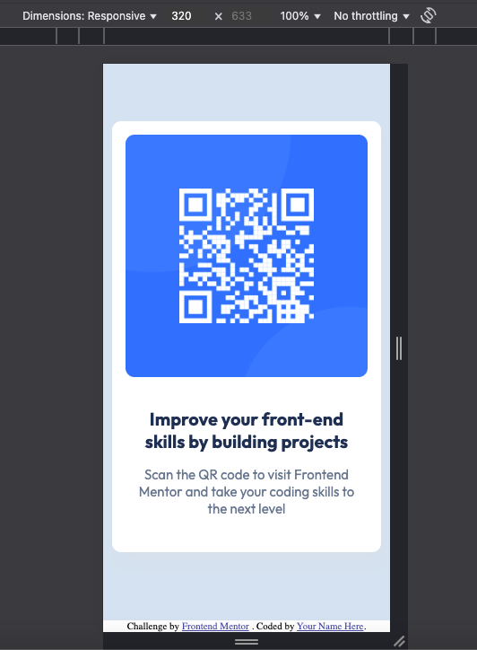
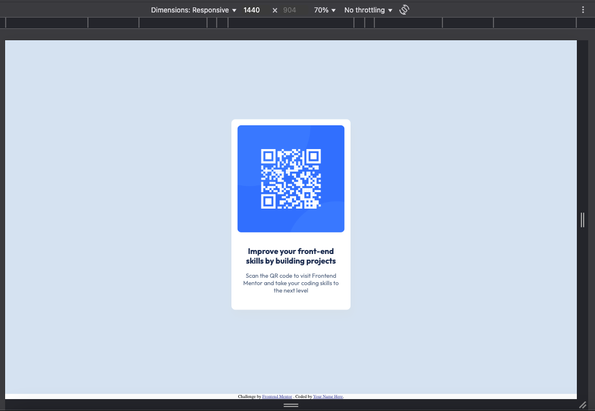

# Frontend Mentor - QR code component solution

This is a solution to the [QR code component challenge on Frontend Mentor](https://www.frontendmentor.io/challenges/qr-code-component-iux_sIO_H). Frontend Mentor challenges help you improve your coding skills by building realistic projects.

## Table of contents

- [Overview](#overview)
  - [Screenshot](#screenshot)
  - [Links](#links)
- [My process](#my-process)
  - [Built with](#built-with)
  - [What I learned](#what-i-learned)
  - [Useful resources](#useful-resources)
- [Acknowledgments](#acknowledgments)

## Overview

This is my first project to complete after my training in HTML and CSS. It was a challenge for me, I learned new things when I finished the project.

### Screenshot

Width for Mobile: 375px


Width for Desktop: 1440px


### Links

- Solution URL:
- Live Site URL: https://qr-code-component-main-tau-silk.vercel.app/

## My process

### Built with

- Semantic HTML5 markup
- CSS custom properties
- Flex

### What I learned

My major learnings while working through this project : "flex"

To see how you can add code snippets, see below:

```css
.container {
  background-color: hsl(212, 45%, 89%);
  width: 100vw;
  height: 100vh;
  display: flex;
  flex-direction: column;
  justify-content: center;
  align-items: center;
}
```

### Useful resources

- https://developer.mozilla.org/fr/docs/Web/CSS/CSS_flexible_box_layout/Aligning_items_in_a_flex_container - This helped me for Aligning elements in a flex container reason. I really liked this pattern and will use it going forward.

## Acknowledgments

To center our box, we'll use the align-items property to align the object to the cross axis. In our example, this axis is the block axis and is oriented vertically. The justify-content property is used to align the object to the main axis (horizontally).
